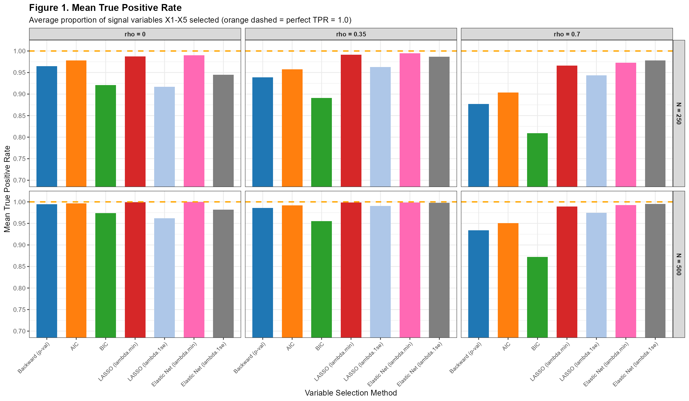
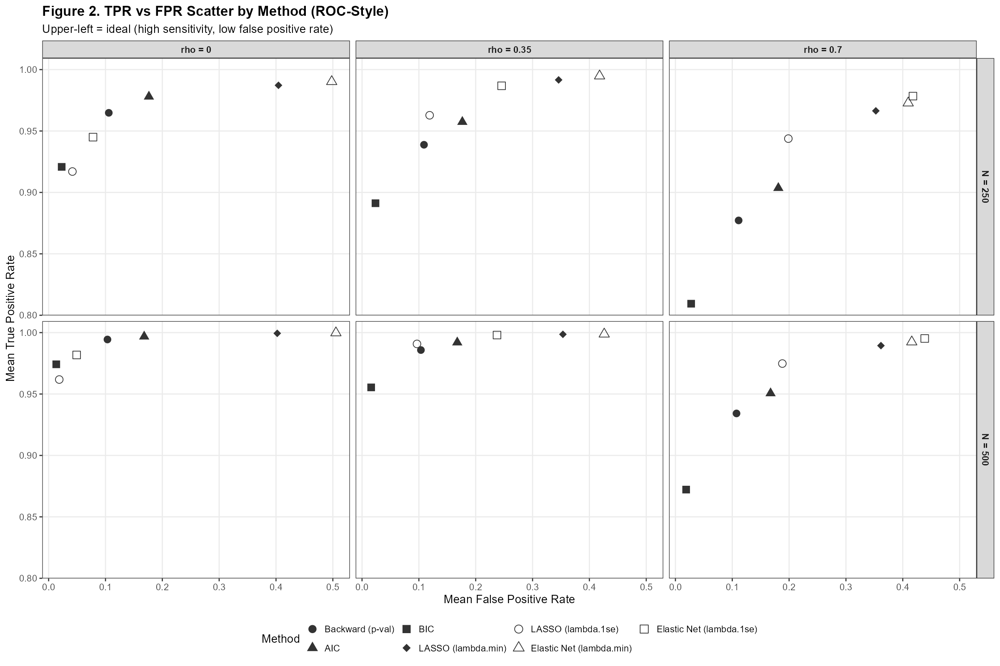
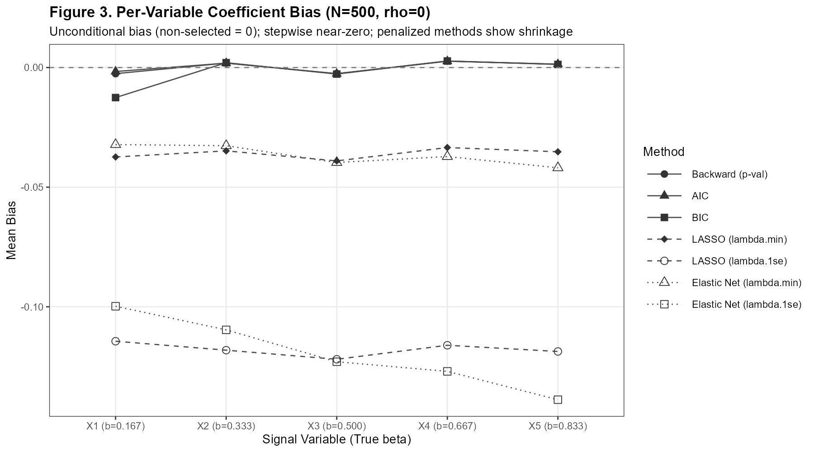
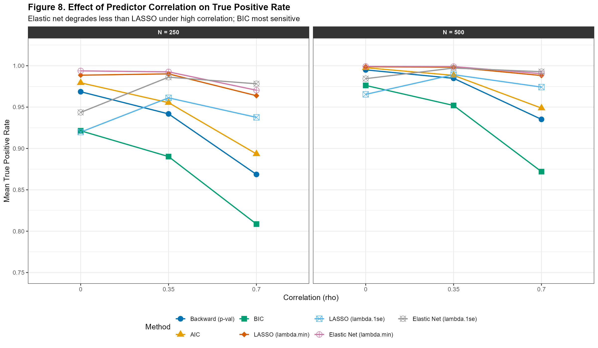

---
output:
  pdf_document:
    latex_engine: xelatex
    number_sections: true
    toc: false
  html_document:
    number_sections: true
    toc: true
    toc_float: true
geometry: "margin=1in"
fontsize: 12pt
linestretch: 2
header-includes:
  - \usepackage{float}
  - \usepackage{titlesec}
  - \titleformat{\section}{\normalsize\bfseries}{\thesection.}{1em}{}
  - \titleformat{\subsection}{\normalsize\bfseries}{\thesubsection}{1em}{}
  - \titlespacing*{\section}{0pt}{12pt}{6pt}
  - \titlespacing*{\subsection}{0pt}{10pt}{4pt}
  - \usepackage{caption}
  - \usepackage{longtable}
  - \usepackage{booktabs}
  - \captionsetup[figure]{labelformat=empty,labelsep=none,font=small}
---

```{r setup, include=FALSE}
if (!requireNamespace('kableExtra', quietly=TRUE)) install.packages('kableExtra')
library(kableExtra)
knitr::opts_chunk$set(
  echo      = FALSE,
  message   = FALSE,
  warning   = FALSE,
  fig.align = "center",
  fig.pos   = "H"
)
```

\noindent Name: Yunjing Hong \hfill Date: `r format(Sys.Date(), '%B %d, %Y')`

\vspace{6pt}

\begin{center}
\textbf{Variable Selection in Linear Regression: A Simulation Study}
\end{center}

\vspace{4pt}

# Introduction/Background

This project investigates the performance of seven variable selection methods for linear regression through a Monte Carlo simulation study. The methods under comparison span classical stepwise approaches (backward elimination and stepwise selection by information criteria) and modern penalized regression methods, namely the LASSO (Tibshirani, 1996) and Elastic Net (Zou and Hastie, 2005). While penalized methods were originally developed for high-dimensional settings, they are increasingly applied in moderate sample size problems where the number of predictors is manageable but selection uncertainty remains. The goal of this study is to evaluate the sensitivity, specificity, coefficient estimation accuracy, and confidence interval validity of each method, and to characterize conditions under which each approach is most appropriate.

# The Model Notation

Data were generated from a linear regression model:

$$Y_i = \beta_0 + \sum_{j=1}^{p} x_{ij}\beta_j + \varepsilon_i, \quad \varepsilon_i \sim N(0, \sigma^2)$$

with $p = 20$ predictors, $\sigma^2 = 1$, and an exchangeable (compound symmetry) correlation structure:

$$\mathbf{X}_i \sim \text{MVN}(\mathbf{0},\, \boldsymbol{\Sigma}), \quad \Sigma_{jk} = \begin{cases} 1 & j = k \\ \rho & j \neq k \end{cases}$$

The first five predictors ($X_1$--$X_5$) were true signals with coefficients $\boldsymbol{\beta}_{\text{signal}} = (1/6,\ 2/6,\ 3/6,\ 4/6,\ 5/6)$, spanning a range of weak to moderate effect sizes. The remaining 15 predictors ($X_6$--$X_{20}$) were null variables with $\beta_j = 0$.

# Methods

Seven variable selection methods were compared, all applied to the full 20-predictor ordinary least squares (OLS) model. Backward elimination (p-val) removes the predictor with the largest p-value at each step if $p \geq 0.10$ (a class decision), continuing until all remaining predictors satisfy $p < 0.10$. Stepwise AIC performs backward selection minimizing the Akaike Information Criterion with penalty $k = 2$ (Akaike, 1974); stepwise BIC applies the same procedure with $k = \log(N)$ (Schwarz, 1978), imposing a heavier complexity penalty. The LASSO (Tibshirani, 1996) minimizes the $L_1$-penalized loss with tuning parameter $\lambda$ selected by 10-fold cross-validation (class decision) at either the minimizing value ($\lambda$`.min`) or the one-standard-error value ($\lambda$`.1se`). The Elastic Net (Zou and Hastie, 2005) combines $L_1$ and $L_2$ penalties with mixing parameter $\alpha = 0.5$ (class decision) and $\lambda$ selected by the same procedure.

For penalized methods, the penalized coefficient estimates from the fitted glmnet model were used for bias calculation, since these reflect actual shrinkage behavior; 95% confidence intervals were obtained by post-selection OLS refit on the selected variable subset.

Performance was evaluated on four metrics: (1) true positive rate (TPR; $1 -$ Type II error rate), the proportion of signal variables $X_1$--$X_5$ selected; (2) false positive rate (FPR; Type I error rate), the proportion of null variables $X_6$--$X_{20}$ selected; (3) mean coefficient bias, the average of $(\hat{\beta}_j - \beta_j)$ computed unconditionally with non-selected variables assigned a coefficient of zero; and (4) empirical 95% confidence interval coverage, the proportion of replications in which the post-selection OLS refit interval contained the true $\beta_j$, computed conditional on selection. Per-variable selection rates for each of $X_1$--$X_5$ were also recorded.

# Simulation

All analyses were conducted in R (version `r paste0(R.Version()$major, ".", R.Version()$minor)`; session details in `Results/sessionInfo.txt`). Predictor matrices were generated using `MASS::mvrnorm()` (Venables and Ripley, 2002); the assignment listed `hdrm::gen_data()` as an option; here `MASS::mvrnorm()` was used directly to implement the same linear-Gaussian data-generating structure with exchangeable covariance. The response was generated as $Y = X\beta + \varepsilon$ with $\varepsilon \sim N(0,1)$ via `rnorm()`. Post-selection OLS refits and confidence intervals were computed using `lm()` and `confint()` from base R. Stepwise methods used `step()` from base R with `direction = "backward"` (deviating from the package default of `"both"`), with `k = 2` for AIC and `k = log(N)` for BIC. LASSO and Elastic Net used `cv.glmnet()` from the `glmnet` package (Friedman et al., 2010) with `nfolds = 10`, `standardize = TRUE` (package default, explicitly confirmed), `alpha = 1` for LASSO, and `alpha = 0.5` for Elastic Net. A single `cv.glmnet()` call per method per replication ensured identical fold assignments for both $\lambda$`.min` and $\lambda$`.1se`.

$B = 1{,}000$ Monte Carlo replications were run per condition. This number was chosen at the investigators' discretion: the Monte Carlo standard error for a proportion is at most $\sqrt{0.25/1000} \approx 0.016$, providing approximately $\pm 2$ percentage-point precision on each TPR and FPR cell. Six conditions crossed two sample sizes ($N \in \{250, 500\}$) with three correlation levels ($\rho \in \{0, 0.35, 0.70\}$; exchangeable structure; both class decisions). The random seed was fixed with `set.seed(2026)` as the first executable line to ensure exact reproducibility. Simulation parameters are summarized in Table 1.

# Results and Discussion

Across all conditions, the seven methods separated into distinct profiles along the TPR-FPR trade-off (Figure 2). BIC consistently achieved the lowest FPR (0.01--0.03), well below the nominal 0.10 level, reflecting its heavy complexity penalty; however, this conservatism resulted in the lowest TPR among all methods, most notably at $N = 250$, $\rho = 0.70$ (TPR = 0.81). AIC favored larger models, with FPR near 0.17 regardless of condition. Backward (p-val) maintained FPR close to its nominal 0.10 threshold while achieving high TPR across conditions, consistent with the p-value criterion calibrating the variable-level Type I error rate. LASSO ($\lambda$`.min`) and Elastic Net ($\lambda$`.min`) achieved the highest TPR but with severely inflated FPR (0.35--0.50), selecting many null variables in nearly every replication; this behavior is consistent with $\lambda$`.min` prioritizing prediction over sparsity. The $\lambda$`.1se` variants substantially reduced FPR while retaining high TPR. At $N = 500$, performance gaps narrowed considerably, with Backward, AIC, LASSO ($\lambda$`.1se`), and Elastic Net ($\lambda$`.1se`) all achieving TPR above 0.95 even at $\rho = 0.70$.

The impact of predictor correlation is shown in Figures 1 and 4. TPR declined with increasing $\rho$ for all methods; BIC degraded most steeply (TPR = 0.92 at $\rho = 0$ to 0.81 at $\rho = 0.70$, $N = 250$), while Elastic Net methods were most robust owing to the $L_2$ component retaining correlated predictors jointly. Differences in TPR were driven primarily by weak signals: at $N = 250$, $\rho = 0.35$, BIC retained $X_1$ ($\beta = 0.167$) in only 47% of replications versus 96% for LASSO ($\lambda$`.min`) and 97% for Elastic Net ($\lambda$`.min`), while $X_3$--$X_5$ ($\beta \geq 0.50$) were recovered by virtually all methods under all conditions.

Coefficient bias and confidence interval coverage (Figure 3, Table 3) revealed a further trade-off. Backward, AIC, and BIC produced near-zero average bias (within $\pm 0.01$) in these simulations, reflecting that the reported coefficients are unpenalized OLS estimates among selected variables, although this does not remove post-selection inferential concerns. LASSO and Elastic Net exhibited systematic negative bias of $-0.04$ to $-0.15$, reflecting penalized-coefficient shrinkage, a property inherent to regularization that persists with increasing $N$. Confidence interval coverage degraded with increasing $\rho$; BIC exhibited the largest decline (to 0.925 at $N = 250$, $\rho = 0.70$), consistent with its average selection of only 4.05 of 5 signal variables, which introduces omitted-variable bias and inflates Type I errors in the refit model. LASSO and Elastic Net with $\lambda$`.1se` maintained coverage near 0.93--0.94 across conditions, slightly below the nominal level but more stable than BIC under high correlation. Because coverage is conditional on selection, it should be interpreted as the calibration of intervals among retained signal variables, not as unconditional inferential validity for all true predictors.

Based on these results, the following recommendations are offered. When valid inference on coefficient estimates is the primary goal, Backward (p-val) is preferred, as it achieves near-zero bias, near-nominal FPR, and coverage close to the nominal level. When maximizing true signal detection while controlling false positives, Elastic Net ($\lambda$`.1se`) is recommended, particularly under moderate-to-high predictor correlation. The $\lambda$`.min` variants of LASSO and Elastic Net are inadvisable when false positive control is a priority. Sample size has a substantial moderating effect: at $N = 500$, most methods achieve TPR above 0.95 even at $\rho = 0.70$.

# Future Work

Several extensions would be valuable. First, extending the comparison to generalized linear models and survival models would address settings where variable selection is equally consequential and elevated FPR carries greater practical consequences. Second, the simulation assumed exact sparsity with a fixed signal-to-noise ratio; performance may differ when most predictors carry small non-zero effects or when the number of predictors approaches $N$. Third, the post-selection OLS refit does not provide fully valid inference; selective inference procedures (Lee et al., 2016) could deliver coverage guarantees without conditioning on the selected model, directly addressing the shortfall observed under high correlation. Fourth, jointly cross-validating the Elastic Net mixing parameter $\alpha$ alongside $\lambda$ may yield further gains under high correlation, and comparison with adaptive LASSO variants that achieve oracle properties would provide additional context for the bias results.

\newpage

# Tables and Figures

```{r table1}
t1 <- data.frame(
  Parameter = c(
    "Replications (B)", "Total predictors (p)", "Signal predictors",
    "Null predictors", "True coefficients (X1-X5)",
    "Error SD ($\\sigma$)", "Sample sizes (N)", "Correlation structure",
    "Correlation values ($\\rho$) [class]", "Backward threshold [class]",
    "LASSO $\\lambda$ choices [class]", "Elastic Net $\\alpha$ [class]",
    "Elastic Net $\\lambda$ choices [class]", "CV folds [class]"
  ),
  Value = c(
    "1,000", "20", "X1--X5", "X6--X20",
    "1/6, 2/6, 3/6, 4/6, 5/6",
    "1", "250, 500", "Exchangeable (compound symmetry)",
    "0, 0.35, 0.70", "p-value $<$ 0.10",
    "$\\lambda$.min, $\\lambda$.1se", "0.50",
    "$\\lambda$.min, $\\lambda$.1se", "10"
  ), stringsAsFactors = FALSE
)
knitr::kable(t1, caption = "Simulation parameter settings.",
             col.names = c("Parameter", "Value"),
             booktabs = TRUE, escape = FALSE,
             format = "latex") |>
  kableExtra::kable_styling(latex_options = c("hold_position","striped"),
                            font_size = 9)
```

```{r table2, message=FALSE, warning=FALSE}
library(dplyr)
results_tbl <- readRDS("../Results/simulation_results.rds")
t2 <- results_tbl |>
  group_by(Method) |>
  summarise(
    `Mean TPR` = round(mean(Mean_TPR), 3),
    `SD TPR`   = round(sd(Mean_TPR),   3),
    `Mean FPR` = round(mean(Mean_FPR), 3),
    `SD FPR`   = round(sd(Mean_FPR),   3),
    .groups = "drop"
  ) |>
  arrange(Method)
knitr::kable(t2,
  caption = "Mean true positive rate (TPR) and false positive rate (FPR) by method, averaged across all six simulation conditions ($N \\in \\{250, 500\\}$, $\\rho \\in \\{0, 0.35, 0.70\\}$). Standard deviations across the six condition-level means are shown in parentheses.",
  col.names = c("Method", "Mean TPR", "SD TPR", "Mean FPR", "SD FPR"),
  booktabs = TRUE, escape = FALSE, format = "latex") |>
  kableExtra::kable_styling(latex_options = c("hold_position","striped"),
                            font_size = 9) |>
  kableExtra::column_spec(1, width = "5cm")
```

```{r table3, message=FALSE, warning=FALSE}
library(dplyr)
results <- readRDS("../Results/simulation_results.rds")
t3 <- results |>
  mutate(
    `Mean Bias`  = sprintf("%.4f", Mean_Bias),
    `95\\% Cov`  = sprintf("%.3f",  Mean_Cov),
    `Avg Sel.`   = sprintf("%.2f",  Mean_N_Sel_Signal)
  ) |>
  select(N, rho, Method, `Mean Bias`, `95\\% Cov`, `Avg Sel.`) |>
  arrange(N, rho, Method)
knitr::kable(t3,
  caption = "Mean coefficient bias (unconditional) and empirical 95\\% confidence interval coverage (conditional on selection) for $X_1$--$X_5$. Avg Sel.\\ = average number of signal variables selected per replication.",
  booktabs = TRUE, escape = FALSE,
  format = "latex",
  longtable = TRUE) |>
  kableExtra::kable_styling(latex_options = c("repeat_header","striped"),
                            font_size = 8) |>
  kableExtra::column_spec(3, width = "4cm")
```

```{r fig1, fig.cap="Figure 1. Mean true positive rate by method, sample size, and correlation. The dashed reference line indicates perfect TPR of 1.0.", out.width="100%"}

```

```{r fig5, fig.cap="Figure 2. Mean true positive rate versus mean false positive rate by method (ROC-style scatter). The upper-left region represents ideal performance.", out.width="100%"}

```

```{r fig7, fig.cap="Figure 3. Per-variable mean coefficient bias at N=500, rho=0 (unconditional; non-selected variables contribute zero). Solid lines denote stepwise methods; dashed lines denote LASSO; dotted lines denote Elastic Net.", out.width="90%"}

```

```{r fig8, fig.cap="Figure 4. Effect of predictor correlation on mean TPR by method and sample size. Solid lines denote stepwise methods; dashed lines denote LASSO; dotted lines denote Elastic Net.", out.width="95%"}

```

# References

Akaike, H. (1974). A new look at the statistical model identification. *IEEE Transactions on Automatic Control*, 19(6), 716--723.

Friedman, J., Hastie, T., and Tibshirani, R. (2010). Regularization paths for generalized linear models via coordinate descent. *Journal of Statistical Software*, 33(1), 1--22.

Lee, J. D., Sun, D. L., Sun, Y., and Taylor, J. E. (2016). Exact post-selection inference, with application to the lasso. *Annals of Statistics*, 44(3), 907--927.

Schwarz, G. (1978). Estimating the dimension of a model. *Annals of Statistics*, 6(2), 461--464.

Tibshirani, R. (1996). Regression shrinkage and selection via the lasso. *Journal of the Royal Statistical Society: Series B*, 58(1), 267--288.

Venables, W. N., and Ripley, B. D. (2002). *Modern Applied Statistics with S* (4th ed.). Springer.

Zou, H., and Hastie, T. (2005). Regularization and variable selection via the elastic net. *Journal of the Royal Statistical Society: Series B*, 67(2), 301--320.

\newpage

# Reproducible Research Information

All statistical code used to produce this report is available at:

GitHub: https://github.com/Charl3456/BIOS6624.git

This is a simulation study; no external data file is required. The script should be run with `Project_4/` as the working directory. The random seed `set.seed(2026)` is the first executable line, ensuring exact reproducibility. Code is fully documented so that another analyst can reproduce every result, table, and figure without ambiguity.

Code (`Code/` directory):

- `Project4_VarSelection_Simulation.R` --- main simulation: data generation, all 7 methods, metric computation, figures, and tables
- `Project4_RegenerateFigures.R` --- regenerate all figures and tables from saved results without re-running the simulation
- `Project4_FinalReport.Rmd` --- R Markdown source for this report

Results (`Results/` directory):

- `simulation_results.csv` --- full condition-level summary (all metrics, all methods)
- `simulation_results.rds` --- full results as R object (preserves factor levels)
- `sessionInfo.txt` --- R session information and package versions

Figures (`Results/Figures/`): `Figure1_TruePositiveRate.png` (Figure 1), `Figure5_TPR_vs_FPR_scatter.png` (Figure 2), `Figure7_PerVariable_Bias_N500_rho0.png` (Figure 3), `Figure8_Correlation_Effect_on_TPR.png` (Figure 4).
