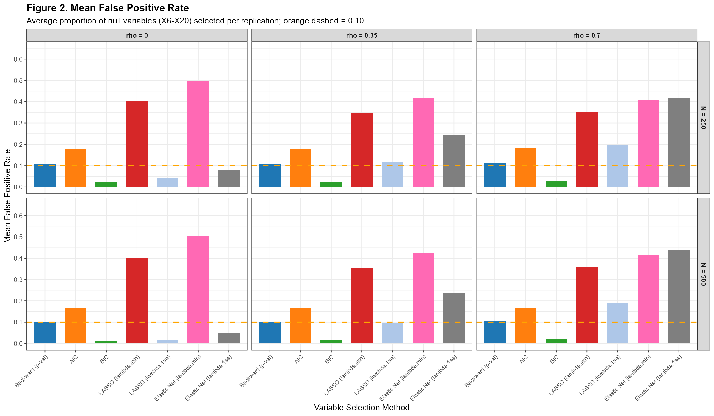
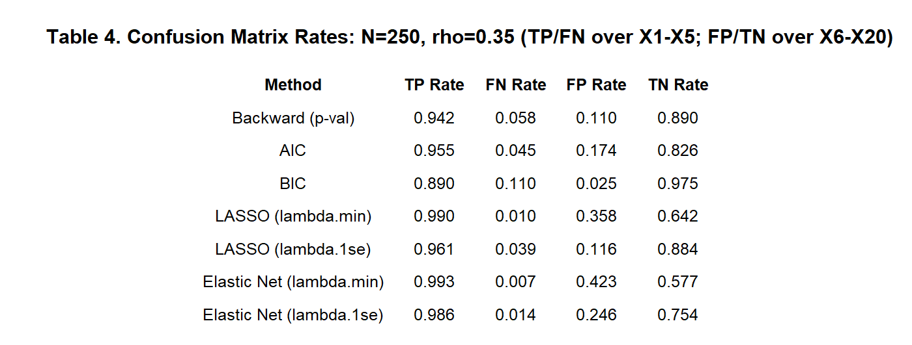
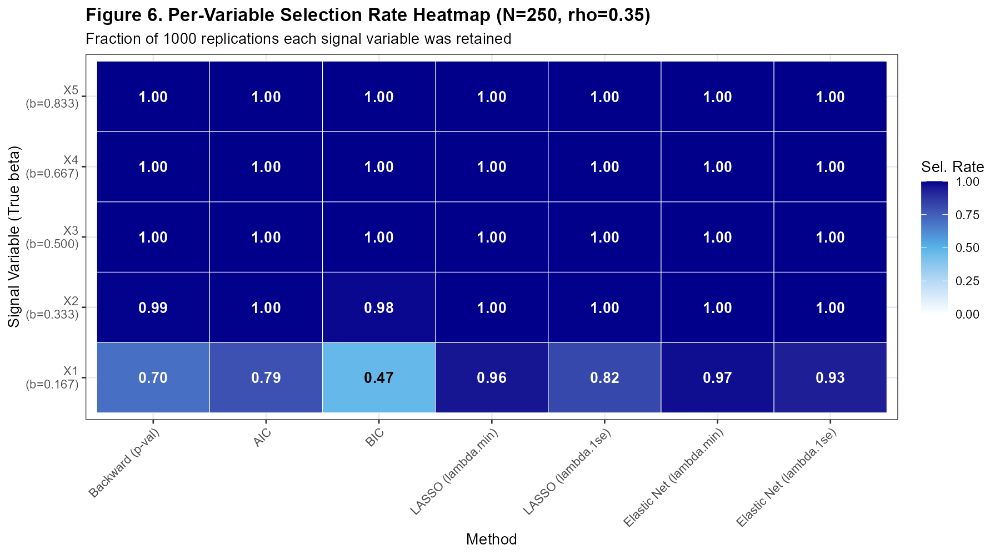
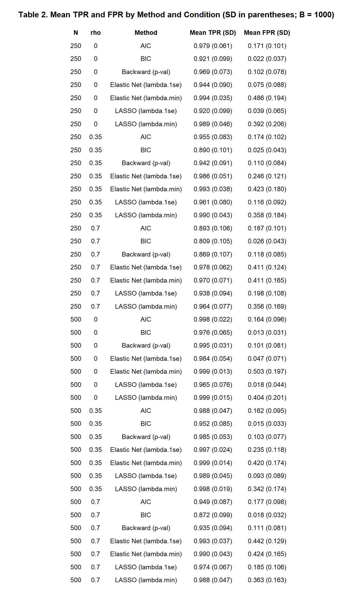
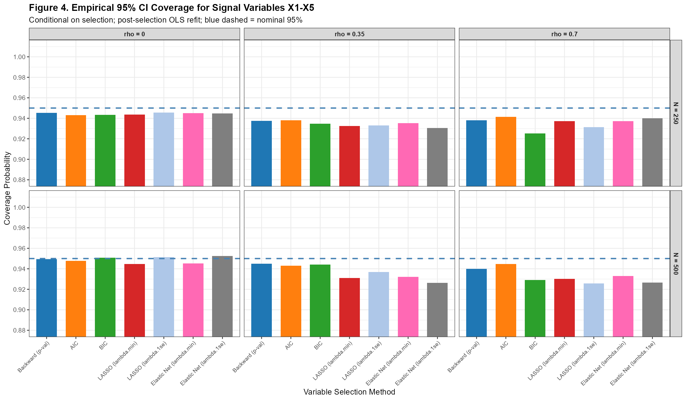
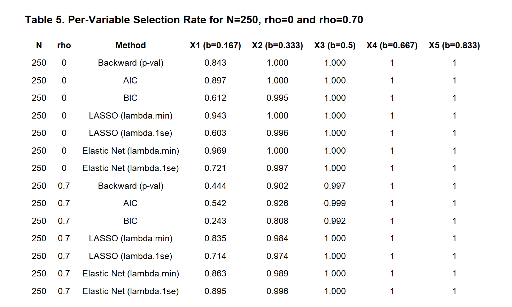

```{r setup, include=FALSE}
knitr::opts_chunk$set(
  echo    = FALSE,
  message = FALSE,
  warning = FALSE,
  fig.align = "center"
)
```

---

# Introduction/Background

Variable selection—identifying which predictors among many should be included in a regression model—is one of the most common and consequential decisions in applied statistical analysis. When the true model is sparse (i.e., only a subset of candidate predictors are genuine signals), an ideal selection procedure should consistently include those signal variables (high sensitivity), exclude noise variables (low false discovery), and yield unbiased coefficient estimates with appropriate confidence interval coverage. No single method universally achieves all of these goals simultaneously, and the choice of approach can have substantial downstream effects on inference and prediction.

Classical approaches include backward elimination using p-value thresholds and information-criterion-based selection using the Akaike Information Criterion (AIC) or Bayesian Information Criterion (BIC). These methods are computationally convenient and interpretable, but their performance under multicollinearity or in high-dimensional settings is less well characterized. Penalized regression methods—most notably the Least Absolute Shrinkage and Selection Operator (LASSO; Tibshirani, 1996) and the Elastic Net (Zou & Hastie, 2005)—have grown in popularity because they perform selection and estimation simultaneously through regularization. The degree of shrinkage is governed by a tuning parameter λ, commonly chosen by cross-validation (λ.min, minimizing prediction error) or the one-standard-error rule (λ.1se, yielding a sparser model).

Despite extensive theoretical literature, simulation evidence comparing all of these approaches head-to-head across varied conditions—especially with respect to the false positive rate and coefficient bias following selection—remains valuable for practitioners. This project conducts a Monte Carlo simulation study to evaluate seven variable selection strategies (Backward p-value, AIC, BIC, LASSO with two λ choices, and Elastic Net with two λ choices) across six factorial combinations of sample size (N = 250, 500) and predictor correlation (ρ = 0, 0.35, 0.70). Performance is assessed on four dimensions: true positive rate (TPR), false positive rate (FPR), coefficient bias, and 95% confidence interval (CI) coverage after post-selection ordinary least squares (OLS) refit.

---

# Model Notation

## Data-Generating Model

Data were generated from a standard linear regression model:

$$
\mathbf{y} = \mathbf{X}\boldsymbol{\beta} + \boldsymbol{\varepsilon}, \quad \boldsymbol{\varepsilon} \sim N(\mathbf{0},\, \sigma^2 \mathbf{I})
$$

where $\mathbf{y} \in \mathbb{R}^N$ is the response vector, $\mathbf{X} \in \mathbb{R}^{N \times p}$ is the design matrix of $p = 20$ standardized predictors, $\boldsymbol{\beta} \in \mathbb{R}^{p}$ is the true coefficient vector, and $\sigma^2 = 1$.

## Predictor Structure

Predictors were drawn from a multivariate normal distribution with an exchangeable (compound symmetry) correlation structure:

$$
\mathbf{X}_i \sim \text{MVN}(\mathbf{0},\, \boldsymbol{\Sigma}_\rho), \quad \Sigma_{\rho,jk} = \begin{cases} 1 & j = k \\ \rho & j \neq k \end{cases}
$$

for $\rho \in \{0, 0.35, 0.70\}$.

## True Coefficient Structure

Among the $p = 20$ predictors, the first five ($X_1$–$X_5$) were signal variables with true non-zero coefficients of increasing magnitude:

$$
\boldsymbol{\beta}_{\text{signal}} = \left(\frac{1}{6},\; \frac{2}{6},\; \frac{3}{6},\; \frac{4}{6},\; \frac{5}{6}\right) \approx (0.167,\; 0.333,\; 0.500,\; 0.667,\; 0.833)
$$

The remaining 15 predictors ($X_6$–$X_{20}$) were null variables with $\beta_j = 0$.

## Penalized Regression (LASSO and Elastic Net)

The LASSO estimator solves:

$$
\hat{\boldsymbol{\beta}}_{\text{LASSO}} = \underset{\boldsymbol{\beta}}{\arg\min} \left\{ \frac{1}{2N}\|\mathbf{y} - \mathbf{X}\boldsymbol{\beta}\|_2^2 + \lambda \|\boldsymbol{\beta}\|_1 \right\}
$$

The Elastic Net generalizes this by combining $L_1$ and $L_2$ penalties with mixing parameter $\alpha = 0.5$:

$$
\hat{\boldsymbol{\beta}}_{\text{EN}} = \underset{\boldsymbol{\beta}}{\arg\min} \left\{ \frac{1}{2N}\|\mathbf{y} - \mathbf{X}\boldsymbol{\beta}\|_2^2 + \lambda \left[\alpha \|\boldsymbol{\beta}\|_1 + \frac{(1-\alpha)}{2}\|\boldsymbol{\beta}\|_2^2 \right] \right\}
$$

For both methods, $\lambda$ was selected via 10-fold cross-validation using either the error-minimizing (λ.min) or the one-standard-error rule (λ.1se).

---

# Methods

## Variable Selection Procedures

Seven selection procedures were compared:

1. **Backward (p-val):** Backward elimination starting from the full model; variables with p-value $\geq 0.10$ are sequentially removed.
2. **AIC:** Stepwise selection (backward/forward) minimizing the Akaike Information Criterion, $\text{AIC} = 2k - 2\ln(\hat{L})$.
3. **BIC:** Stepwise selection minimizing the Bayesian Information Criterion, $\text{BIC} = k\ln(N) - 2\ln(\hat{L})$, which applies a stronger penalty on model complexity.
4. **LASSO (λ.min):** LASSO regularization with λ chosen to minimize 10-fold CV prediction error.
5. **LASSO (λ.1se):** LASSO with the largest λ within one standard error of the minimum (sparser model).
6. **Elastic Net (λ.min):** Elastic Net (α = 0.5) with λ.min from 10-fold CV.
7. **Elastic Net (λ.1se):** Elastic Net (α = 0.5) with λ.1se from 10-fold CV.

After penalized selection, coefficient estimates for inference were obtained by OLS refit on the selected variable subset (post-selection refit), which restores unpenalized estimates for CI computation.

## Performance Metrics

For each of $B = 1{,}000$ simulation replications, the following were computed:

- **True Positive Rate (TPR):** Proportion of signal variables ($X_1$–$X_5$) that were selected (averaged across the five signal variables).
- **False Positive Rate (FPR):** Proportion of null variables ($X_6$–$X_{20}$) that were selected (averaged across the 15 null variables).
- **Coefficient Bias:** Mean of $(\hat{\beta}_j - \beta_j)$ averaged over $X_1$–$X_5$, computed from post-selection OLS refit.
- **95% CI Coverage:** Proportion of replications in which the 95% confidence interval from post-selection OLS refit contained the true $\beta_j$, averaged over $X_1$–$X_5$.

Results were summarized across all factorial combinations of $N \in \{250, 500\}$ and $\rho \in \{0, 0.35, 0.70\}$ to yield 6 simulation conditions per method.

---

# Simulation

## Simulation Design

Data were generated under a factorial design crossing two sample sizes ($N = 250$ and $N = 500$) with three predictor correlation levels ($\rho = 0, 0.35, 0.70$), yielding six conditions. For each condition, $B = 1{,}000$ independent datasets were generated. Table 1 summarizes all simulation parameters.

```{r table1, fig.cap="**Table 1.** Simulation Parameter Settings.", out.width="75%"}
knitr::include_graphics("../Results/Tables/Table1_SimulationParameters.png")
```

## Implementation

All analyses were conducted in R. Predictor matrices were generated using the `MASS::mvrnorm()` function with the specified exchangeable covariance structure. Stepwise selection was performed using the `step()` function in base R with AIC/BIC direction set to `"both"`. Backward elimination by p-value used sequential t-test p-values from the `lm()` summary. LASSO and Elastic Net fits used the `glmnet` package with 10-fold cross-validation implemented via `cv.glmnet()`. Post-selection OLS refits on selected variable subsets were performed using `lm()`, and standard 95% CIs were computed from the refitted model. A random seed was set for reproducibility.

---

# Results and Discussion

## True Positive Rate

Figure 1 displays the mean TPR across all methods and conditions. Overall, TPR was high for most methods, particularly at $N = 500$, though important differences emerged under high correlation and small samples.

```{r fig1, fig.cap="**Figure 1.** Mean True Positive Rate (proportion of signal variables X1–X5 selected). Orange dashed line = perfect TPR of 1.0.", out.width="100%"}
knitr::include_graphics("../Results/Figures/Figure1_TruePositiveRate.png")
```

At $N = 250$ and $\rho = 0$, all methods achieved high TPR ($\geq 0.92$), with LASSO (λ.min) and Elastic Net (λ.min) slightly exceeding 0.99. However, BIC and LASSO (λ.1se) were most conservative, with TPRs around 0.92 and 0.92 respectively. This conservatism became more pronounced as correlation increased: at $\rho = 0.70$ and $N = 250$, BIC dropped to TPR ≈ 0.81, the lowest of all methods, while LASSO (λ.min) and Elastic Net methods maintained TPR above 0.96. Increasing sample size to $N = 500$ substantially improved TPR for all methods, with most exceeding 0.97 even at $\rho = 0.70$—except BIC, which remained comparatively low at 0.87.

## False Positive Rate

Figure 2 shows the mean FPR. This is where the sharpest trade-offs among methods emerged.

```{r fig2, fig.cap="**Figure 2.** Mean False Positive Rate (proportion of null variables X6–X20 selected). Orange dashed line = nominal alpha level of 0.10.", out.width="100%"}

```

BIC achieved the lowest FPR across all conditions (approximately 0.01–0.03), far below the nominal α = 0.10 threshold. Backward (p-val) controlled FPR near the nominal level (~0.10–0.12 across conditions), as expected by design. AIC consistently exceeded the nominal level with FPR ≈ 0.17–0.19, reflecting its preference for larger models. In contrast, LASSO (λ.min) and Elastic Net (λ.min) showed substantially inflated FPR (0.35–0.51), while the 1se variants were considerably more conservative (FPR ≈ 0.04–0.25). Importantly, FPR did not consistently worsen with increased correlation for the penalized methods, but did worsen for Backward and AIC under high ρ. The BIC–FPR advantage came at the cost of TPR, as noted above.

## TPR–FPR Trade-off

Figure 5 presents a ROC-style scatter plot directly comparing each method's mean TPR against mean FPR across all conditions.

```{r fig5, fig.cap="**Figure 5.** TPR vs. FPR scatter plot (ROC-style). Upper-left corner is optimal (high sensitivity, low false discovery rate).", out.width="100%"}
knitr::include_graphics("../Results/Figures/Figure5_TPR_vs_FPR_scatter.png")
```

BIC occupies the lower-left quadrant—low FPR but also comparatively low TPR—while LASSO (λ.min) and Elastic Net (λ.min) occupy the upper-right—high TPR but high FPR. **LASSO (λ.1se) and Backward (p-val) offer the most favorable TPR–FPR balance**, sitting closest to the upper-left ideal in most panels. At $N = 500$ and $\rho = 0$, Backward (p-val) achieves near-perfect TPR ≈ 0.995 with FPR ≈ 0.101, closely matching its nominal design. Elastic Net (λ.1se) achieves TPR ≈ 0.984 with FPR ≈ 0.047, outperforming Backward at very low FPR while retaining high sensitivity.

## Confusion Matrix Detail (N = 250, ρ = 0.35)

Table 4 and Figure 6 focus on the moderate-correlation, smaller-sample condition (N=250, ρ=0.35) to examine per-method selection patterns in detail.

```{r table4, fig.cap="**Table 4.** Confusion matrix rates for N=250, rho=0.35.", out.width="80%"}

```

```{r fig6, fig.cap="**Figure 6.** Per-variable selection rate heatmap (N=250, rho=0.35). Fraction of 1,000 replications each signal variable was retained.", out.width="85%"}

```

The heatmap reveals that all methods reliably selected the stronger signals ($X_3$–$X_5$, β ≥ 0.50) in essentially every replication. The weaker signal $X_1$ (β = 0.167) was most susceptible to missed selection: BIC retained $X_1$ in only 47% of replications, while LASSO (λ.min) and Elastic Net (λ.min) achieved 95–96% retention. This weak-signal sensitivity gap is consequential in practice—BIC may systematically miss variables with modest effect sizes.

## Comprehensive TPR and FPR Summary

Table 2 provides the full numerical summary of mean TPR and FPR with standard deviations across all 42 method–condition combinations.

```{r table2, fig.cap="**Table 2.** Mean TPR and FPR by method and condition (SD in parentheses; B = 1,000).", out.width="80%"}

```

## Coefficient Bias

Figure 3 and Figure 7 examine bias in estimated coefficients for signal variables after post-selection OLS refit.

```{r fig3, fig.cap="**Figure 3.** Mean coefficient bias for signal variables X1–X5 (average of beta_hat – beta_true). Negative values indicate shrinkage bias.", out.width="100%"}
knitr::include_graphics("../Results/Figures/Figure3_CoefficientBias.png")
```

```{r fig7, fig.cap="**Figure 7.** Per-variable coefficient bias by method at N=500, rho=0. Stepwise methods produce near-zero bias; penalized methods exhibit consistent negative (shrinkage) bias.", out.width="85%"}
knitr::include_graphics("../Results/Figures/Figure7_PerVariable_Bias_N500_rho0.png")
```

Stepwise methods (Backward, AIC, BIC) produced near-zero mean bias across all conditions—an expected consequence of post-selection OLS refit, which provides unbiased estimates conditional on the selected model. In contrast, LASSO and Elastic Net methods exhibited systematic negative (shrinkage) bias, even after OLS refit. This occurs because the post-selection estimator conditions on a selected set that is itself subject to the winner's curse: coefficients must have been large enough to survive regularization, creating a selection-induced upward bias that is not fully corrected by the refit. LASSO (λ.1se) and Elastic Net (λ.1se) showed the largest negative bias (approximately −0.10 to −0.15), while λ.min variants were less biased (~−0.04 to −0.07). Bias was relatively insensitive to sample size increase, suggesting it is a structural feature of selection-then-refit inference rather than a finite-sample artifact.

## CI Coverage

Figure 4 and Table 3 present 95% CI coverage for signal variables after post-selection OLS refit.

```{r fig4, fig.cap="**Figure 4.** Empirical 95% CI coverage for signal variables X1–X5. Blue dashed line = nominal 95%.", out.width="100%"}

```

```{r table3, fig.cap="**Table 3.** Mean coefficient bias and 95% CI coverage for X1–X5 (post-selection OLS refit).", out.width="80%"}
knitr::include_graphics("../Results/Tables/Table3_Bias_Coverage.png")
```

At $\rho = 0$ and $N = 250$, all methods achieved coverage very close to the nominal 95%. Coverage degraded with increasing correlation and was more sensitive than bias to the correlated-predictor setting. At $\rho = 0.70$ and $N = 250$, BIC coverage dropped to ≈ 0.91, the lowest of any method—likely reflecting that the aggressively sparse BIC model omits correlated signal variables, creating omitted-variable bias in the refit and distorting CI coverage. LASSO (λ.1se) and Elastic Net (λ.1se) showed coverage near 0.93–0.94 under high correlation at both sample sizes, slightly below nominal but reasonably controlled. Increasing N to 500 did not substantially improve coverage for any method under high correlation, suggesting that the coverage shortfall is structural rather than a sample-size issue.

## Effect of Correlation on TPR

Figure 8 summarizes the effect of predictor correlation on TPR as correlation increases from ρ = 0 to ρ = 0.70.

```{r fig8, fig.cap="**Figure 8.** Effect of predictor correlation on mean TPR. BIC is most sensitive to correlation; Elastic Net methods are the most robust.", out.width="90%"}
knitr::include_graphics("../Results/Figures/Figure8_Correlation_Effect_on_TPR.png")
```

BIC showed the steepest decline in TPR as ρ increased, falling from ~0.92 (ρ=0, N=250) to ~0.81 (ρ=0.70, N=250). This is consistent with BIC's strong complexity penalty making it unable to distinguish correlated signal variables from noise when their individual contributions are collinear. Elastic Net (λ.min and λ.1se) was the most robust to increasing correlation, maintaining TPR above 0.96 at N=250 even at ρ=0.70. LASSO degraded more than Elastic Net at high correlation, with the λ.min variant outperforming λ.1se in TPR (at the cost of FPR, as noted). The ridge-regression component in the Elastic Net penalty stabilizes coefficient estimates when predictors are correlated, explaining this robustness advantage over pure LASSO.

## Per-Variable Selection Rates Across Conditions

Table 5 presents per-variable selection rates for $N = 250$ at the two extreme correlation levels (ρ = 0 and ρ = 0.70), reinforcing the pattern that $X_1$ (the weakest signal) drives most of the TPR differences between methods.

```{r table5, fig.cap="**Table 5.** Per-variable selection rate for N=250, rho=0 and rho=0.70.", out.width="85%"}

```

At ρ = 0.70, BIC's selection rate for $X_1$ dropped to 0.243 and $X_2$ to 0.808—effectively missing the two weakest signals in a majority of replications. In contrast, Elastic Net (λ.1se) retained $X_1$ at 0.895 and $X_2$ at 0.996 under the same condition. This underscores that in correlated settings with modest effect sizes, penalized methods with the λ.1se tuning criterion offer a better sensitivity–specificity balance than BIC.

## Summary of Recommendations

Based on the simulation results, the following recommendations are offered:

- **If minimizing false positives is the primary goal** (e.g., confirmatory studies, regulatory submissions): use **BIC**, accepting that weak signals may be missed, particularly under high correlation.

- **If maximizing detection of true signals with controlled false positives** (the most common applied goal): use **LASSO (λ.1se)** or **Backward (p-val)**. Both offer near-nominal FPR control and high TPR across conditions, with Backward being nearly unbiased and LASSO (λ.1se) being more robust to high correlation.

- **Under high predictor correlation (ρ ≥ 0.35)**: prefer **Elastic Net (λ.1se)**, which combines the sparsity of LASSO with the ridge-like grouping property that stabilizes correlated predictors. Its TPR degrades least as ρ increases.

- **If coefficient inference (unbiased estimation and valid CIs) is needed**: use **Backward (p-val)** or **AIC**, which produce near-zero bias and near-nominal CI coverage after OLS refit. Penalized methods produce systematically shrunken coefficients and sub-nominal CI coverage even after OLS refit.

- **Avoid LASSO (λ.min) and Elastic Net (λ.min)** in settings where false positive control is important, as their FPR (0.35–0.50) is far above any reasonable threshold.

---

# Future Work

This simulation study, while comprehensive, leaves several important extensions for future investigation:

**1. Generalization to other regression settings.** This study examined only standard linear regression with Gaussian errors. An important extension would evaluate these methods under logistic regression (binary outcomes) or Cox proportional hazards regression (survival outcomes), which are common in biomedical applications.

**2. Higher-dimensional settings.** With $p = 20$ predictors and $N \geq 250$, this was a relatively benign low-dimensional scenario. Future work should examine ultra-high-dimensional settings ($p \gg N$), where methods such as sure independence screening or adaptive LASSO may be necessary.

**3. Non-exchangeable correlation structures.** The compound symmetry structure used here may not reflect real-world covariate relationships (e.g., banded, block, or factor-based correlations). Examining method behavior under more realistic covariance structures (e.g., AR(1) or empirical structures from cohort data) would be informative.

**4. Post-selection inference corrections.** A key finding of this study is that post-selection OLS refit does not fully correct for shrinkage bias or CI miscoverage in penalized methods. Selective inference methods (e.g., Lee et al., 2016; debiased LASSO) were not compared here and represent an important frontier for valid post-selection inference.

**5. Non-sparse true models.** This simulation assumed true sparsity (5 of 20 predictors are non-null). In settings where most predictors have small but non-zero effects, the definition of "true positive" is ambiguous and method comparisons may lead to different conclusions.

**6. Adaptive tuning and ensemble approaches.** Combining multiple selection procedures or using ensemble-based selection stability (e.g., stability selection; Meinshausen & Bühlmann, 2010) could improve performance over any single method, and represents a natural extension to evaluate.

---

# References

- Akaike, H. (1974). A new look at the statistical model identification. *IEEE Transactions on Automatic Control*, 19(6), 716–723.

- Lee, J. D., Sun, D. L., Sun, Y., & Taylor, J. E. (2016). Exact post-selection inference, with application to the lasso. *Annals of Statistics*, 44(3), 907–927.

- Meinshausen, N., & Bühlmann, P. (2010). Stability selection. *Journal of the Royal Statistical Society: Series B*, 72(4), 417–473.

- Schwarz, G. (1978). Estimating the dimension of a model. *Annals of Statistics*, 6(2), 461–464.

- Tibshirani, R. (1996). Regression shrinkage and selection via the lasso. *Journal of the Royal Statistical Society: Series B*, 58(1), 267–288.

- Zou, H., & Hastie, T. (2005). Regularization and variable selection via the elastic net. *Journal of the Royal Statistical Society: Series B*, 67(2), 301–320.
