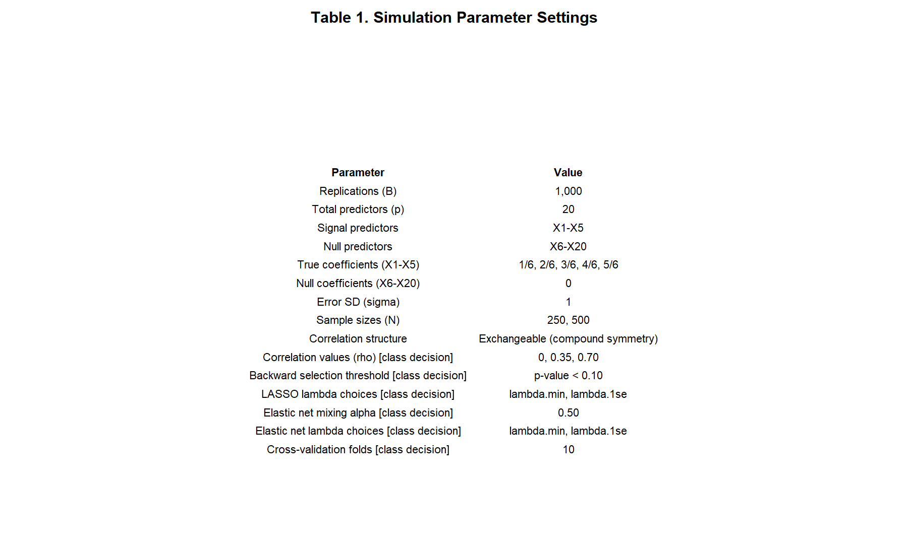
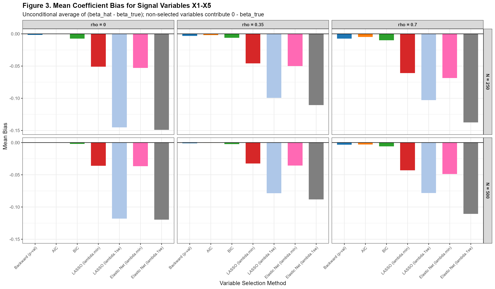
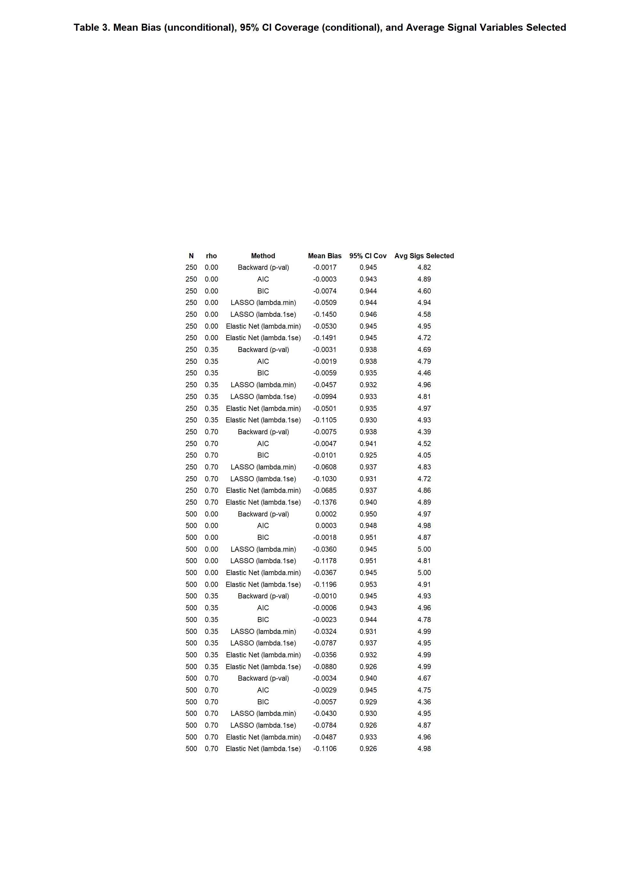

---
output:
  pdf_document:
    latex_engine: xelatex
    number_sections: true
    toc: false
  html_document:
    number_sections: true
    toc: true
    toc_float: true
geometry: "margin=1in"
fontsize: 12pt
linestretch: 2
header-includes:
  - \usepackage{float}
  - \usepackage{titlesec}
  - \titleformat{\section}{\normalsize\bfseries}{\thesection.}{1em}{}
  - \titleformat{\subsection}{\normalsize\bfseries}{\thesubsection}{1em}{}
  - \titlespacing*{\section}{0pt}{12pt}{6pt}
  - \titlespacing*{\subsection}{0pt}{10pt}{4pt}
---

```{r setup, include=FALSE}
knitr::opts_chunk$set(
  echo      = FALSE,
  message   = FALSE,
  warning   = FALSE,
  fig.align = "center",
  fig.pos   = "H"
)
```

\noindent Name: Yunji \hfill Date: `r format(Sys.Date(), '%B %d, %Y')`

\vspace{6pt}

\begin{center}
\textbf{Variable Selection in Linear Regression: A Simulation Study}
\end{center}

\vspace{4pt}

# Introduction/Background

This project investigates the performance of seven variable selection methods for linear regression through a Monte Carlo simulation study. The methods under comparison span classical stepwise approaches -- backward elimination and stepwise selection by information criteria -- and modern penalized regression methods, namely the LASSO (Tibshirani, 1996) and Elastic Net (Zou and Hastie, 2005). While penalized methods were originally developed for high-dimensional settings, they are increasingly applied in moderate sample size problems where the number of predictors is manageable but selection uncertainty remains. The goal of this study is to determine what benefit, if any, penalized methods offer over standard selection procedures in such settings, specifically with respect to sensitivity, specificity, coefficient estimation, and confidence interval validity. Performance is evaluated across combinations of sample size and predictor correlation to characterize conditions under which each method is most appropriate.

# The Model Notation

Data were generated from a linear regression model:

$$Y_i = \beta_0 + \sum_{j=1}^{p} x_{ij}\beta_j + \varepsilon_i, \quad \varepsilon_i \sim N(0, \sigma^2)$$

with $p = 20$ predictors, $\sigma^2 = 1$, and an exchangeable (compound symmetry) correlation structure:

$$\mathbf{X}_i \sim \text{MVN}(\mathbf{0},\, \boldsymbol{\Sigma}), \quad \Sigma_{jk} = \begin{cases} 1 & j = k \\ \rho & j \neq k \end{cases}$$

The first five predictors ($X_1$--$X_5$) were true signals with coefficients $\boldsymbol{\beta}_{\text{signal}} = (1/6,\ 2/6,\ 3/6,\ 4/6,\ 5/6)$, spanning a range of weak to moderate effect sizes. The remaining 15 predictors ($X_6$--$X_{20}$) were null variables with $\beta_j = 0$.

# Methods

Seven variable selection methods were compared, all applied to the same full 20-predictor OLS model as the starting point. **Backward (p-val)** eliminates predictors one at a time, removing the predictor with the largest p-value at each step if $p \geq 0.10$ (a class decision), repeating until all remaining predictors satisfy $p < 0.10$. **AIC** performs backward stepwise selection minimizing the Akaike Information Criterion (Akaike, 1974). **BIC** performs backward stepwise selection minimizing the Bayesian Information Criterion (Schwarz, 1978), applying a heavier complexity penalty of $k = \log(N)$ versus $k = 2$ for AIC. **LASSO** (Tibshirani, 1996) minimizes the $L_1$-penalized loss; the tuning parameter $\lambda$ was selected by 10-fold cross-validation (class decision) at either the minimizing value ($\lambda$`.min`) or the one-standard-error value ($\lambda$`.1se`), yielding a sparser model. **Elastic Net** (Zou and Hastie, 2005) combines $L_1$ and $L_2$ penalties with mixing parameter $\alpha = 0.5$ (class decision), with $\lambda$ chosen by the same cross-validation procedure.

For penalized methods, the penalized glmnet coefficients were used for bias calculation to reflect actual shrinkage behavior; 95% confidence intervals were obtained by post-selection OLS refit on the selected variable subset.

Performance was assessed on four metrics: (1) **TPR (1 $-$ Type II error rate)** -- proportion of signal variables $X_1$--$X_5$ selected; (2) **FPR (Type I error rate)** -- proportion of null variables $X_6$--$X_{20}$ selected; (3) **Mean Coefficient Bias** -- mean of $(\hat{\beta}_j - \beta_j)$, computed unconditionally: non-selected variables receive a coefficient estimate of zero, capturing the full cost of missed signals; and (4) **95% CI Coverage** -- proportion of replications where the OLS refit CI contained the true $\beta_j$, computed conditional on selection since CIs only exist for variables in the final model. Per-variable selection rates for each of $X_1$--$X_5$ were also recorded.

# Simulation

All analyses were conducted in R (version `r paste0(R.Version()$major, ".", R.Version()$minor)`; session details in `Results/sessionInfo.txt`). Predictor matrices were generated using `MASS::mvrnorm()` (Venables and Ripley, 2002); the assignment listed `hdrm::gen_data()` as an alternative which produces equivalent draws. The response was generated as $Y = X\beta + \varepsilon$ with $\varepsilon \sim N(0,1)$ drawn via `rnorm()`. Post-selection OLS refits and confidence intervals were computed using `lm()` and `confint()` from base R. Stepwise methods used `step()` from base R with `direction = "backward"` (deviating from the default `"both"`) with `k = 2` for AIC and `k = log(N)` for BIC. LASSO and Elastic Net used `cv.glmnet()` from the `glmnet` package (Friedman et al., 2010) with `nfolds = 10`, `standardize = TRUE` (package default, explicitly confirmed), `alpha = 1` for LASSO and `alpha = 0.5` for Elastic Net. A single `cv.glmnet()` call was made per penalized method per replication; both $\lambda$`.min` and $\lambda$`.1se` were extracted from the same cross-validation object to ensure identical fold assignments across the two $\lambda$ choices.

$B = 1{,}000$ Monte Carlo replications were run per condition. This number was chosen at our discretion: the Monte Carlo standard error for a proportion is $\sqrt{p(1-p)/B} \leq \sqrt{0.25/1000} \approx 0.016$, providing $\pm$2 percentage-point precision on each TPR and FPR cell. Six conditions crossed two sample sizes ($N \in \{250, 500\}$) with three correlation levels ($\rho \in \{0, 0.35, 0.70\}$, exchangeable structure; both class decisions). The random seed was fixed with `set.seed(2026)` as the first executable line to ensure exact reproducibility. Simulation parameters are summarized in Table 1.

\newpage

# Results and Discussion

Across all conditions, the seven methods separated into distinct profiles along the TPR-FPR trade-off (Figure 5). BIC consistently achieved the lowest FPR (0.01--0.03) but also the lowest TPR, most notably at $N = 250$, $\rho = 0.70$ (TPR = 0.81). AIC favored larger models with FPR near 0.17 regardless of condition. Backward (p-val) maintained FPR close to its nominal 0.10 threshold while achieving high TPR across conditions. LASSO ($\lambda$`.min`) and Elastic Net ($\lambda$`.min`) achieved the highest TPR but with severely inflated FPR (0.35--0.50), making them unsuitable when false positive control matters. The $\lambda$`.1se` variants substantially reduced FPR while retaining high TPR, placing them closest to the ideal upper-left corner of Figure 5. At $N = 500$, performance gaps between methods narrowed considerably, with Backward, AIC, LASSO ($\lambda$`.1se`), and Elastic Net ($\lambda$`.1se`) all achieving TPR above 0.95 even at $\rho = 0.70$.

The impact of predictor correlation is shown in Figures 1 and 8. As $\rho$ increased from 0 to 0.70, TPR declined for all methods, with BIC degrading most steeply (TPR = 0.92 at $\rho = 0$ to 0.81 at $\rho = 0.70$, $N = 250$) and Elastic Net methods being most robust due to the $L_2$ component retaining correlated predictors together. Per-variable analysis showed that weak signals drove most TPR differences: at $N = 250$, $\rho = 0.35$, BIC retained $X_1$ ($\beta = 0.167$) in only 47% of replications, compared to 70% for Backward, 79% for AIC, 96% for LASSO ($\lambda$`.min`), and 97% for Elastic Net ($\lambda$`.min`), while $X_3$--$X_5$ ($\beta \geq 0.50$) were reliably recovered by all methods in virtually every replication regardless of $N$ or $\rho$.

Coefficient bias and CI coverage (Figure 3, Table 3) revealed a further trade-off. Backward, AIC, and BIC produced near-zero bias; LASSO and Elastic Net exhibited systematic negative bias of $-0.04$ to $-0.15$ reflecting penalized-coefficient shrinkage. CI coverage degraded with increasing $\rho$; BIC showed the largest drop (to 0.925 at $N = 250$, $\rho = 0.70$) consistent with its average of only 4.05 of 5 signal variables selected, while LASSO and Elastic Net with $\lambda$`.1se` maintained coverage near 0.93--0.94 across conditions -- slightly below nominal but more stable than BIC under high correlation.

**Recommendations.** For valid inference (low bias, correct CI coverage), **Backward (p-val)** is preferred -- near-zero bias, near-nominal FPR and coverage across conditions. For maximizing true signal detection while controlling false positives, **Elastic Net ($\lambda$`.1se`)** is recommended, especially under moderate-to-high predictor correlation. **LASSO ($\lambda$`.min`) and Elastic Net ($\lambda$`.min`)** should be avoided when FPR control is important. Sample size matters: at $N = 500$, most methods achieve TPR above 0.95 even at $\rho = 0.70$.

# Future Work

Several extensions would be valuable. First, this study was limited to main-effects linear regression; extending to logistic or Cox proportional hazards regression would directly address applied settings where variable selection is equally important. Second, the simulation assumed exact sparsity with 5 true signals among 20 predictors -- conclusions may differ substantially when most predictors have small non-zero effects, a common real-world scenario. Third, the OLS refit approach does not produce fully valid post-selection inference; selective inference corrections (Lee et al., 2016) could provide coverage guarantees without conditioning on the selected model. Finally, the Elastic Net mixing parameter $\alpha$ was fixed at 0.5 (class decision); allowing $\alpha$ to be tuned by cross-validation alongside $\lambda$ may yield further gains, particularly under high predictor correlation.

\newpage

# Tables and Figures

```{r table1, fig.cap="Table 1. Simulation parameter settings.", out.width="70%"}

```

```{r fig1, fig.cap="Figure 1. Mean True Positive Rate by method, sample size, and correlation. Orange dashed line = perfect TPR of 1.0.", out.width="100%"}
knitr::include_graphics("../Results/Figures/Figure1_TruePositiveRate.png")
```

```{r fig5, fig.cap="Figure 5. TPR vs. FPR scatter (ROC-style). Upper-left corner is ideal.", out.width="100%"}
knitr::include_graphics("../Results/Figures/Figure5_TPR_vs_FPR_scatter.png")
```

```{r fig3, fig.cap="Figure 3. Mean coefficient bias for signal variables X1-X5 (unconditional: non-selected = 0). Negative values indicate shrinkage bias.", out.width="100%"}

```

```{r fig8, fig.cap="Figure 8. Effect of predictor correlation on mean TPR. BIC degrades most steeply; Elastic Net methods are most robust.", out.width="95%"}
knitr::include_graphics("../Results/Figures/Figure8_Correlation_Effect_on_TPR.png")
```

```{r table3, fig.cap="Table 3. Mean coefficient bias (unconditional) and 95% CI coverage (conditional on selection) for X1-X5, with average signal variables selected.", out.width="80%"}

```

# References

Akaike, H. (1974). A new look at the statistical model identification. *IEEE Transactions on Automatic Control*, 19(6), 716--723.

Friedman, J., Hastie, T., and Tibshirani, R. (2010). Regularization paths for generalized linear models via coordinate descent. *Journal of Statistical Software*, 33(1), 1--22.

Lee, J. D., Sun, D. L., Sun, Y., and Taylor, J. E. (2016). Exact post-selection inference, with application to the lasso. *Annals of Statistics*, 44(3), 907--927.

Schwarz, G. (1978). Estimating the dimension of a model. *Annals of Statistics*, 6(2), 461--464.

Tibshirani, R. (1996). Regression shrinkage and selection via the lasso. *Journal of the Royal Statistical Society: Series B*, 58(1), 267--288.

Venables, W. N., and Ripley, B. D. (2002). *Modern Applied Statistics with S* (4th ed.). Springer.

Zou, H., and Hastie, T. (2005). Regularization and variable selection via the elastic net. *Journal of the Royal Statistical Society: Series B*, 67(2), 301--320.

\newpage

# Reproducible Research Information

All statistical code used to produce this report is available at:

**GitHub:** [https://github.com/[your-username]/BIOS6624-Project4](https://github.com/[your-username]/BIOS6624-Project4)

This is a simulation study; no external data file is required. The script should be run with `Project_4/` as the working directory. The random seed `set.seed(2026)` is the first executable line, ensuring exact reproducibility. Code is fully commented so another analyst can reproduce every result without guesswork.

| Location | File | Description |
|---|---|---|
| `Code/` | `Project4_VarSelection_Simulation.R` | Main simulation: data generation, all 7 methods, metric computation, figure/table output |
| `Code/` | `Project4_RegenerateFigures.R` | Regenerate figures/tables from saved results without re-running simulation |
| `Code/` | `Project4_FinalReport.Rmd` | R Markdown source for this report |
| `Results/` | `simulation_results.csv` | Full condition-level summary (all metrics, all methods) |
| `Results/` | `simulation_results.rds` | Full results as R object |
| `Results/` | `sessionInfo.txt` | R session information (package versions) for exact reproducibility |
| `Results/Figures/` | `Figure1_TruePositiveRate.png` | Mean TPR by method, N, and rho |
| `Results/Figures/` | `Figure3_CoefficientBias.png` | Mean coefficient bias (unconditional) |
| `Results/Figures/` | `Figure5_TPR_vs_FPR_scatter.png` | ROC-style TPR vs. FPR scatter |
| `Results/Figures/` | `Figure8_Correlation_Effect_on_TPR.png` | Effect of correlation on TPR |
| `Results/Tables/` | `Table1_SimulationParameters.png` | Full simulation parameter settings |
| `Results/Tables/` | `Table3_Bias_Coverage.png` | Coefficient bias and 95% CI coverage |
